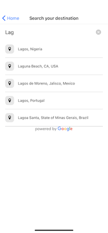
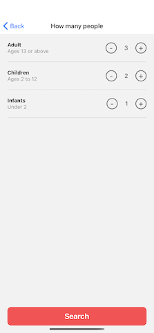
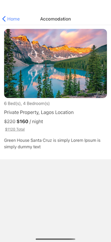

# Airbnb Clone

This is an example clone of [Airbnb](https://www.airbnb.com/?) built with [React Native](https://facebook.github.io/react-native/).

## Setup

This project was bootstrapped with [Create React Native App](https://github.com/react-community/create-react-native-app) and [Typescript](https://www.typescriptlang.org), below you'll find information about performing common tasks.

### Technologies Used

[React Native](https://reactnative.dev)

[Typescript](https://www.typescriptlang.org)

[AWS Amplify](https://docs.amplify.aws)

[GraphQl](https://graphql.org)

[React Navigation](https://reactnavigation.org)

[React Native Vector Icons](https://github.com/oblador/react-native-vector-icons)

[react native maps](https://github.com/react-native-community/react-native-maps#readme)

[react native google places autocomplete](https://github.com/FaridSafi/react-native-google-places-autocomplete#readme)

## Project Screen Shots

## Installation and Setup Instructions

You will need Node, Watchman, and the React Native command line interface. I recommend installing Node and Watchman using [Homebrew](https://brew.sh). Run the following commands in a Terminal after installing Homebrew: `brew install node` and `brew install watchman`. If you have already installed Node on your system, make sure it is Node 10 or newer.

#### Project Setup

1. Download / Clone the code: `git clone https://github.com/kpose/AirbnbClone.git`
2. Open the project root directory and run `npm install` to install all dependencies
3. CD into ios directory and run `pod install` to install all pods
4. Run `npx react-native start` inside the project folder to start React Native Metro Bundler
5. Open a new terminal inside the project folder. Run the following: `npx react-native run-ios`
   You should see your new app running in the iOS Simulator shortly.
